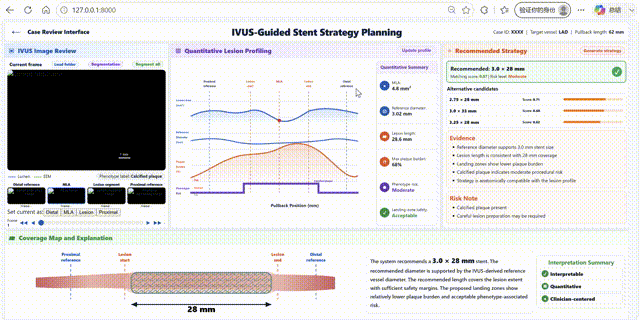

# IVUS Visualized Stent Strategy Matching Demo

This repository provides a demo implementation of a **quantitative IVUS-driven visualized strategy matching framework** for interpretable coronary stent planning.

The demo focuses on visualizing how IVUS-derived anatomical evidence supports stent strategy selection, including lumen/EEM contours, quantitative lesion profiles, candidate stent ranking, and coverage-map explanation.

## Repository structure

```text
.
├── docs/                 # Static GitHub Pages demo, no backend required
├── local_demo/           # Current browser frontend for local backend use
├── backend/              # FastAPI backend for segmentation and strategy pipeline
├── strategy/             # Original Python strategy scripts
├── examples/             # Synthetic demo frames, masks, and demo JSON output
├── requirements.txt
└── .gitignore
```


## Option 1: Static web demo

Open `docs/index.html` directly in a browser, or enable GitHub Pages using:

```text
Settings → Pages → Branch: main → Folder: /docs
```

The static demo uses synthetic/anonymized demo values and does not require Python, model weights, or clinical data.

## Option 2: Local backend demo

Install dependencies:

```bash
pip install -r requirements.txt
```

Start the backend:

```bash
cd backend
python backend_segmentation.py
```

Start the frontend:

```bash
cd local_demo
python -m http.server 8000
```

Then open:

```text
http://127.0.0.1:8000
```

Suggested operation sequence:

```text
Load folder → Segment all → Update profile → Generate strategy
```

## Model weights and private data

The trained segmentation weights and original clinical IVUS data are **not included**. The repository includes only synthetic demo images and precomputed example outputs for demonstration.

Before running the full backend pipeline, update the following paths in `backend/backend_segmentation.py` and the strategy scripts:

```python
TRANSUNET_ROOT = "..."
WEIGHT_PATH = "..."
MASK_SAVE_ROOT = "..."
TARGET_SUMMARY_CSV = "..."
STRATEGY_SUMMARY_CSV = "..."
CLEAN_PROFILE_DIR = "..."
```

## Features

- IVUS frame review with lumen/EEM overlay
- Full-sequence mask cache loading
- Quantitative lesion profile visualization
- MLA-centered target lesion and PB-rich burden separation
- Candidate stent strategy ranking
- Coverage map and parameter-level explanation

## Disclaimer

This demo is for research visualization only. It is not intended for clinical diagnosis, treatment planning, or medical device prescription.

## Citation

If this demo is useful for your research, please cite the associated paper once available.
